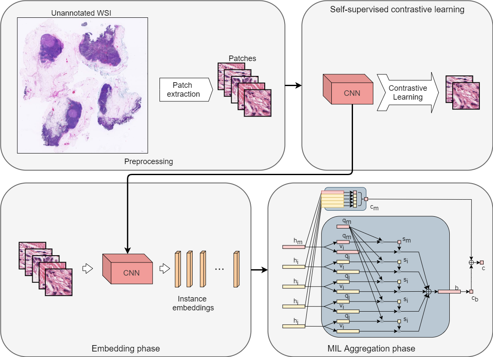

# Automated Detection of Filamentous Fungal Keratitis Using Corneal Smears with Dual-stream multiple instance learning DSMIL
Pytorch implementation for the fungal keratitis multiple instance learning network with self-supervised contrastive learning.

Repository forked and edited from Bin Li et al. DSMIL-WSI [repository](https://github.com/binli123/dsmil-wsi) and paper [Dual-stream Multiple Instance Learning Network for Whole Slide Image Classification with Self-supervised Contrastive Learning](https://arxiv.org/abs/2011.08939).  

<!-- <div align="center">
  
</div>

<div align="center">
  
</div> -->

## Installation
Install [anaconda/miniconda](https://docs.conda.io/en/latest/miniconda.html)  
Required packages
```
  $ conda env create --name dsmil --file env.yml
  $ conda activate dsmil
```
Install [PyTorch](https://pytorch.org/get-started/locally/)  
Install [OpenSlide and openslide-python](https://pypi.org/project/openslide-python/).  
[Tutorial 1](https://openslide.org/) and [Tutorial 2 (Windows)](https://www.youtube.com/watch?v=0i75hfLlPsw).  


## Training on your own datasets
1. Place WSI files as `WSI\[DATASET_NAME]\[CATEGORY_NAME]\[SLIDE_FOLDER_NAME] (optional)\SLIDE_NAME.svs`. 
> For binary classifier, the negative class should have `[CATEGORY_NAME]` at index `0` when sorted alphabetically. For multi-class classifier, if you have a negative class (not belonging to any of the positive classes), the folder should have `[CATEGORY_NAME]` at **the last index** when sorted alphabetically. The naming of the class folders does not matter if you do not have a negative class.
2. Crop patches.  
```
  $ python deepzoom_tiler.py -m 0 -b 20 -d [DATASET_NAME]
```
>Set flag `-m [LEVEL 1] [LEVEL 2]` to crop patches from multiple magnifications. 

We used:
```
  $ python deepzoom_tiler.py --magnifications 0 1  --base_mag 20 --dataset KOH_Dataset_test_lambda --background_t 7 --quality 100
  $ python deepzoom_tiler.py --magnifications 0 1  --base_mag 20 --dataset KOH_Dataset_train_lambda --background_t 7 --quality 100
```
with:
```
  --magnifications 0 1  # Crop patches from magnification 0 and 1.
  --base_mag 20         # Base magnification.
  --dataset [DATASET_NAME]  # Dataset folder name.
  --background_t 7       # Threshold for background detection.
  --quality 100          # JPEG quality (compression or not).

```

3. Train an embedder.  
- Edit /simclr/config.yaml to set the parameters for training the embedder (epochs, batch size, etc).
```
  $ cd simclr
  $ python run.py --dataset=[DATASET_NAME]
```
>Set flag `--multiscale=1` and flag `--level=low` or `--level=high` to train an embedder for each magnification if the patches are cropped from multiple magnifications.   

We used:
```
python run.py --dataset=KOH_Dataset_train_lambda --multiscale=1 --level=low
python run.py --dataset=KOH_Dataset_train_lambda --multiscale=1 --level=high
```

4. Compute features using the embedder.  
```
  $ cd ..
  $ python compute_feats.py --dataset=[DATASET_NAME]
```
>Set flag `--magnification=tree` to compute the features for multiple magnifications.
>This will use the last trained embedder to compute the features, if you want to use an embedder from a specific run, add the option `--weights=[RUN_NAME]`, where `[RUN_NAME]` is a folder name inside `simclr/runs/`. If you have an embedder you want to use, you can place the weight file as `simclr/runs/[RUN_NAME]/checkpoints/model.pth` and pass the `[RUN_NAME]` to this option. To use a specific embedder for each magnification, set option `--weights_low=[RUN_NAME]` (embedder for low magnification) and `--weights_high=[RUN_NAME]` (embedder for high magnification). The embedder architecture is ResNet18 with **instance normalization**.     

We used:
```
$ python compute_feats.py --dataset=KOH_Dataset_train_lambda --num_classes 1 --magnification tree --weights_low=Apr10_02-11-44_Lambda --weights_high=Apr18_15-57-02_Lambda
$ python compute_feats.py --dataset=KOH_Dataset_test_lambda --num_classes 1 --magnification tree --weights_low=Apr10_02-11-44_Lambda --weights_high=Apr18_15-57-02_Lambda
```

5. Training.
```
  $ python train_tcga.py --dataset=[DATASET_NAME]
```
Now use screen and log the file output to train.log
```
  $ screen -S train
  $ conda activate dsmil
  <!-- $ python train_tcga.py --dataset=KOH_Dataset_train_lambda --num_classes=1 --feats_size=1024 --num_epochs 200 --stop_epochs 25 > train.log -->
  $ python train_tcga_v2.py --dataset=KOH_Dataset_train_lambda --num_classes=1 --feats_size=1024 --num_epochs 200 --stop_epochs 25 > train.log
```

>You will need to adjust `--num_classes` option if the dataset contains more than 2 positive classes or only 1 positive class and 1 negative class (binary classifier). See the next section for details.  

### Useful arguments:
```
[--num_classes]       # Number of non-negative classes, for a binary classification (postive/negative), this is set to 1
[--feats_size]        # Size of feature vector (depends on the CNN backbone and whether patch fusion was used)
[--lr]                # Initial learning rate [0.0001]
[--num_epochs]        # Number of training epochs [50]
[--stop_epochs]       # Skip remaining epochs if training has not improved after N epochs [10]
[--weight_decay]      # Weight decay [1e-3]
[--dataset]           # Dataset folder name
[--split]             # Training/validation split [0.2]
[--dropout_patch]     # Randomly dropout a portion of patches and replace with duplicates during training [0]
[--dropout_node]      # Randomly dropout a portion of nodes in the value vector generation network during training [0]
```

In our case, we create train_test.py and train 5 fold CV with a completely separate test set. This notebook includes WSI feature merging if they belong to the same patient (starts with the same name). Customize to your liking.
```
$ python train_tcga_v2.py --dataset=KOH_Dataset_train_lambda --dataset_test=KOH_Dataset_test_lambda --num_classes=1 --feats_size=1024 --num_epochs 200 --stop_epochs 25
```
### Understanding different evaluation schemes and metrics
>Different training and evaluation schemes can be choosen by setting the arugment (--eval_scheme).
#### --eval_scheme=5-fold-cv
>A 5-fold cross-validation. For each fold, AUC and accuracy score will be computed on the validation set. Averaged values across the 5 folds will be computed after all folds complete.
#### --eval_scheme=5-fold-cv-standalone-test
>A standalone test set consisting of 20% samples is reserved, remaining 80% samples are used to construct a 5-fold cross-validation.  
>For each fold, the best model and corresponding threshold are saved.    
>After the 5-fold cross-validation, 5 best models along with the corresponding optimal thresholds are obtained which are used to perform inference on the reserved test set. A final prediction for a test sample is the majority vote of the 5 models.  
>For a binary classification, accuracy and balanced accuracy score are computed. For a multi-label classification, hamming loss (smaller the better) and subset accuracy are computed.  


6. Testing.
```
  $ python attention_map.py --bag_path test/patches --map_path test/output --thres 0.73 0.28
```
What we used:
```
$ python attention_map.py --bag_path test/test_bags/Fungal_Positive --map_path test/output --thres 0.5693772435188293 --aggregator_weights test/test_lowmag/mil_weights_fold_2.pth --embedder_weights test/test_lowmag/embedder_low.pth
```


Useful arguments:
```
[--num_classes]         # Number of non-negative classes.
[--feats_size]          # Size of feature vector (depends on the CNN backbone).
[--thres]               # List of thresholds for the classes returned by the training function.
[--embedder_weights]    # Path to the embedder weights file (saved by SimCLR). Use 'ImageNet' if ImageNet pretrained embedder is used.
[--aggregator_weights]  # Path to the aggregator weights file.
[--bag_path]            # Path to a folder containing folders of patches.
[--patch_ext]            # File extensino of patches.
[--map_path]            # Path of output attention maps.
```

- To obtain useful heatmap overlays, run the script WSI_heatmap.py after generating the heatmaps.  Make sure to edit the directories to reflect your folder structure. This code will loop over WSI images, generate high resolution images, and overlay the heatmaps generated previously on the images.
```
  $ python WSI_heatmap.py
```

## Folder structures
Data is organized in two folders, `WSI` and `datasets`. `WSI` folder contains the images and `datasets` contains the computed features.
```
root
|-- WSI
|   |-- DATASET_NAME
|   |   |-- CLASS_1
|   |   |   |-- SLIDE_1.svs
|   |   |   |-- ...
|   |   |-- CLASS_2
|   |   |   |-- SLIDE_1.svs
|   |   |   |-- ...
```
Once patch extraction is performed, `sinlge` folder or `pyramid` folder will appear.
```
root
|-- WSI
|   |-- DATASET_NAME
|   |   |-- single
|   |   |   |-- CLASS_1
|   |   |   |   |-- SLIDE_1
|   |   |   |   |   |-- PATCH_1.jpeg
|   |   |   |   |   |-- ...
|   |   |   |   |-- ...
|   |   |-- pyramid
|   |   |   |-- CLASS_1
|   |   |   |   |-- SLIDE_1
|   |   |   |   |   |-- PATCH_LOW_1
|   |   |   |   |   |   |-- PATCH_HIGH_1.jpeg
|   |   |   |   |   |   |-- ...
|   |   |   |   |   |-- ...
|   |   |   |   |   |-- PATCH_LOW_1.jpeg
|   |   |   |   |   |-- ...
|   |   |   |   |-- ...
```
Once feature computing is performed, `DATASET_NAME` folder will appear inside `datasets` folder.
```
root
|-- datasets
|   |-- DATASET_NAME
|   |   |-- CLASS_1
|   |   |   |-- SLIDE_1.csv
|   |   |   |-- ...
|   |   |-- CLASS_2
|   |   |   |-- SLIDE_1.csv
|   |   |   |-- ...
|   |   |-- CLASS_1.csv
|   |   |-- CLASS_2.csv
|   |   |-- DATASET_NAME.csv
```
  
## Feature vector csv files explanation
1. For each bag, there is a .csv file where each row contains the feature of an instance. The .csv is named as "_bagID_.csv" and put into a folder named "_dataset-name_/_category_/".  

<div align="center">
  
</div>  

2. There is a "_dataset-name_.csv" file with two columns where the first column contains the paths to all _bagID_.csv files, and the second column contains the bag labels.  

<div align="center">
  
</div>  

3. Labels.
> For binary classifier, use `1` for positive bags and `0` for negative bags. Use `--num_classes=1` at training.  
> For multi-class classifier (`N` positive classes and one optional negative class), use `0~(N-1)` for positive classes. If you have a negative class (not belonging to any one of the positive classes), use `N` for its label. Use `--num_classes=N` (`N` equals the number of **positive classes**) at training.