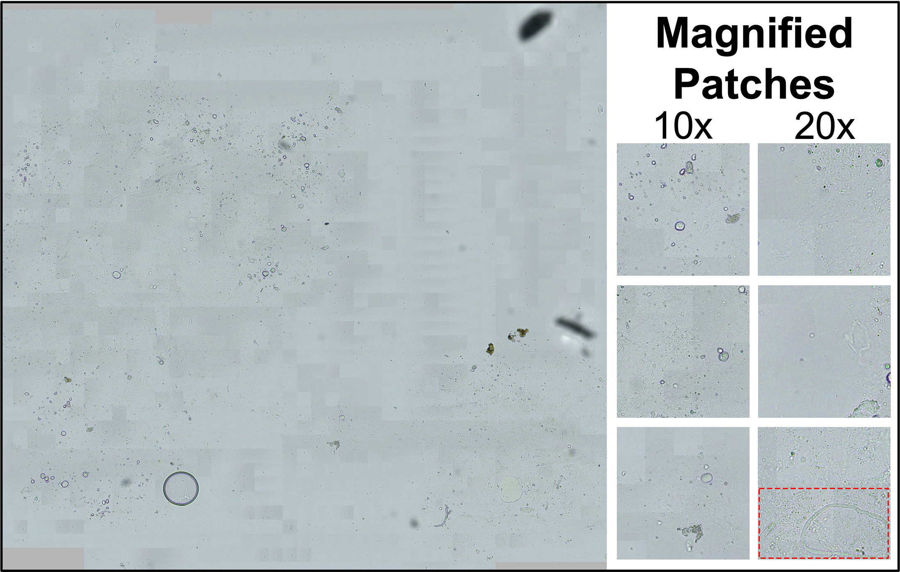
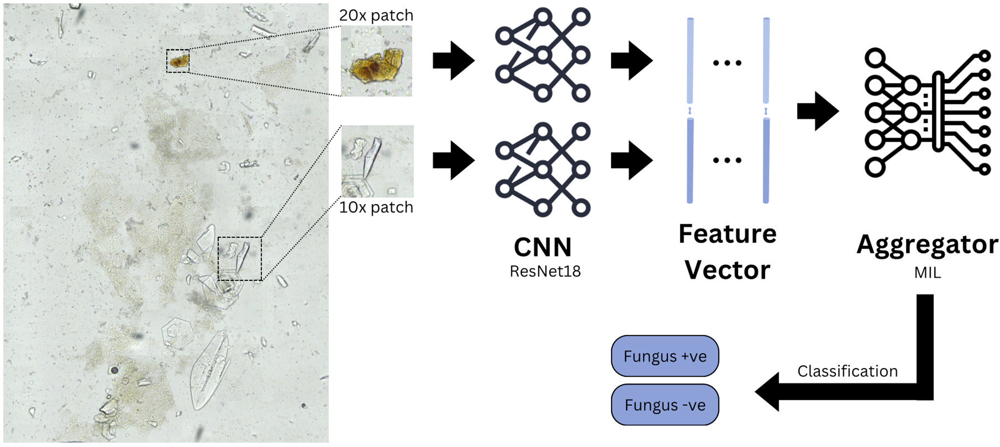
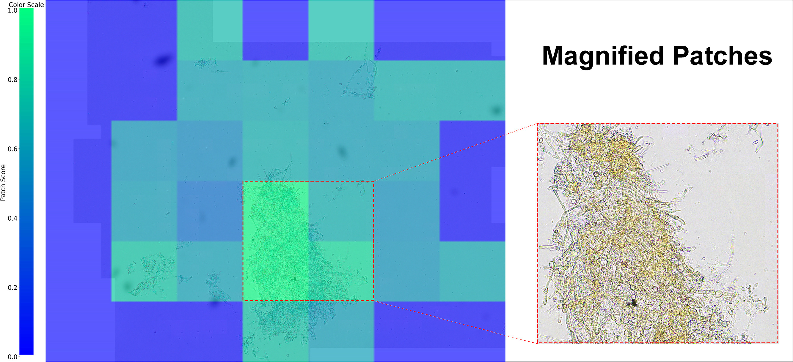
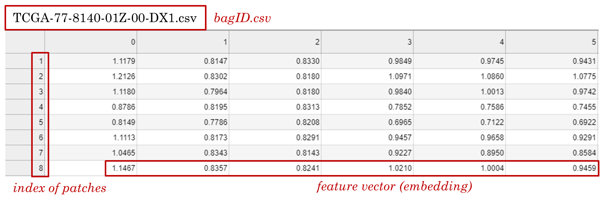
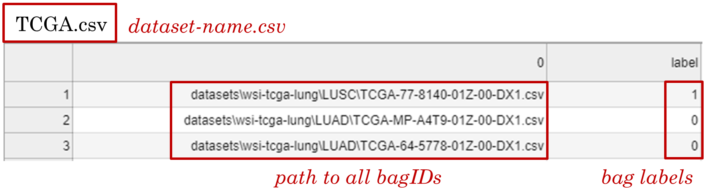

# 🔬 DSMIL-KOH: AI-Powered Fungal Keratitis Detection on Whole Slide Imaging

[](https://www.ophthalmologyscience.org/article/S2666-9145(24)00189-1/)
[](https://www.python.org/downloads/release/python-380/)
[](https://pytorch.org/)
[](LICENSE)

> 🎯 **Automated Detection of Filamentous Fungal Keratitis on Whole Slide Images of Potassium Hydroxide Smears with Multiple Instance Learning**

## 📋 Overview

This repository provides an algorithm developed to detect filamentous fungal keratitis in potassium hydroxide (KOH) smears through multiple instance learning, enhanced by self-supervised contrastive learning. The model was trained on a dataset from Aravind Eye Hospital in Madurai, India, comprising data from 568 patients (51% testing positive for filamentous fungi).

In tests (15% of data), the algorithm achieved an **AUC of 0.88** and an **accuracy of 0.79**. It also generates heatmaps that identify regions in the smear slide most relevant to classification, aiding interpretability. This tool has potential for rapid, automated KOH smear interpretation, supporting timely clinical decision-making.

### 📚 Publication

Our work has been published in **Ophthalmology Science**. Read the full paper [here](https://www.ophthalmologyscience.org/article/S2666-9145(24)00189-1/fulltext).

## Figure 1: Whole Slide Image of a KOH Smear



*Whole slide image of a KOH smear demonstrating fungal filaments. The WSI file (visualized on the left with low magnification) allows visualization of patches at different magnifications, enabling detailed observation of fungal filaments (see red box).*

## Figure 2: DSMIL Framework for Analyzing Fungal Infections in WSIs



*Schematic of the DSMIL Framework for Analyzing Fungal Infections in WSIs. Feature vectors from the 20x and its corresponding 10x patch are fused together and used as inputs in the aggregator.*

## Figure 3: Attention Heatmap of a Consensus Case



*Attention heatmap of a consensus case that the model correctly predicted to contain fungus. Heatmap overlay on the WSI, with the critical instances highlighted. The normalized attention scores visually demonstrate the model's focus on relevant areas. The critical instance, indicated by the highest attention score, aligns well with the region containing fungal elements.*

## Installation

1. Install [anaconda/miniconda](https://docs.conda.io/en/latest/miniconda.html)  
2. Required packages:

```bash
  conda env create --name dsmil --file env.yml
  conda activate dsmil
```

3. Install [PyTorch](https://pytorch.org/get-started/locally/)  
4. Install [OpenSlide and openslide-python](https://pypi.org/project/openslide-python/).  
[Tutorial 1](https://openslide.org/) and [Tutorial 2 (Windows)](https://www.youtube.com/watch?v=0i75hfLlPsw).  

## KOH Smear Models

Download the KOH smear fungal keratitis detection models [here](https://github.com/Redd-Cornea-AI/KOH-Smear-DSMIL/releases/tag/v1.0). This release contains:

- Two embedders (for 10x and 20x magnifications).
- An aggregator model.

To test this model on your own whole slide images (WSIs), place the three `.pth` files in the `/models` directory and execute the `inference.py` script.  

### Testing on your own KOH Smear WSIs (Inference)

For single slide inference, use the `inference.py` script. This script processes individual WSI files and provides predictions along with attention heatmaps.

```bash
python inference.py \
    --slide_path path/to/wsi.svs \
    --embedder_low models/low_mag_embedder.pth \
    --embedder_high models/high_mag_embedder.pth \
    --aggregator models/aggregator.pth \
    --output_dir inference_test \
    --tile_size 224 \
    --background_threshold 7 \
    --base_mag 20 \
    --magnifications 0 1 \
    --device cpu \
    --detection_threshold 0.4597581923007965 \
```

Useful arguments:

```text
--slide_path            # Path to input WSI file (.svs format)
--embedder_low          # Path to low magnification embedder weights
--embedder_high         # Path to high magnification embedder weights
--aggregator            # Path to aggregator model weights
--output_dir            # Directory to save attention heatmap (optional)
--tile_size             # Size of patches to extract (default: 224)
--background_threshold  # Threshold for background filtering (default: 7)
--base_mag              # Base magnification of WSI (default: 20)
--magnifications        # Magnification levels to use (default: [0, 1])
--device                # Device to use (cpu or cuda, default: auto-detect)
--detection_threshold   # Threshold for positive detection (default: 0.5)
--average               # Average bag and instance predictions (if used during training)
--debug                 # Print debug information
--debug_model           # Print detailed model debugging information
--nonlinear             # Additional nonlinear operation (default: 1)
--feature_size          # Size of feature vector, 512 per magnification (default: 1024)
```

The script will output:

- Binary prediction (Positive/Negative)
- Prediction probability
- Attention heatmap (if output_dir is specified)

> The detection threshold for our aggregator was chosen at `0.5710366368293762`. Our algorithm was trained with a base magnification of 20x with levels of 0 and 1, a tile size of 224px, with a minimum background entropy threshold (patch filtering) of 7. When using our models, use similar parameters for best results.

## Training on Your Dataset

### 1. Data Organization

1. Place WSI files in the following structure:

   ```
   WSI\[DATASET_NAME]\[CATEGORY_NAME]\[SLIDE_FOLDER_NAME] (optional)\SLIDE_NAME.svs
   ```

   > **Important Note**: For binary classifiers, the negative class should have `[CATEGORY_NAME]` at index `0` when sorted alphabetically. For multi-class classifiers with a negative class, the folder should have `[CATEGORY_NAME]` at **the last index** when sorted alphabetically. The naming of class folders is flexible if you don't have a negative class.

### 2. Patch Extraction

1. Basic patch extraction command:

   ```bash
   python deepzoom_tiler.py -m 0 -b 20 -d [DATASET_NAME]
   ```

2. For multiple magnifications:

   ```bash
   python deepzoom_tiler.py -m 0 1 -b 20 -d [DATASET_NAME]
   ```

   Example from our study:

   ```bash
   python deepzoom_tiler.py --magnifications 0 1  --base_mag 20 --dataset KOH_Dataset_test_lambda --background_t 7 --quality 100
   python deepzoom_tiler.py --magnifications 0 1  --base_mag 20 --dataset KOH_Dataset_train_lambda --background_t 7 --quality 100
   ```

   **Key Parameters:**

   ```text
   --magnifications 0 1  # Crop patches from magnification 0 and 1
   --base_mag 20        # Base magnification
   --dataset           # Dataset folder name
   --background_t 7    # Threshold for background detection
   --quality 100       # JPEG quality (compression or not)
   ```

### 3. Embedder Training

1. Configure embedder parameters in `simclr/config.yaml`

2. Basic training command:

   ```bash
   cd simclr
   python run.py --dataset=[DATASET_NAME]
   ```

3. For multiple magnifications:

   ```bash
   cd simclr
   python run.py --dataset=[DATASET_NAME] --multiscale=1 --level=low
   python run.py --dataset=[DATASET_NAME] --multiscale=1 --level=high
   ```

>Set flag `--multiscale=1` and flag `--level=low` or `--level=high` to train an embedder for each magnification if the 
patches are cropped from multiple magnifications:  

   Example from our study:

   ```bash
   python run.py --dataset=KOH_Dataset_train_lambda --multiscale=1 --level=low
   python run.py --dataset=KOH_Dataset_train_lambda --multiscale=1 --level=high
   ```

### 4. Feature Extraction

1. Basic feature extraction:

   ```bash
   cd ..
   python compute_feats.py --dataset=[DATASET_NAME]
   ```

>Set flag `--magnification=tree` to compute the features for multiple magnifications.
>This will use the last trained embedder to compute the features, if you want to use an embedder from a specific run, add the option `--weights=[RUN_NAME]`, where `[RUN_NAME]` is a folder name inside `simclr/runs/`. If you have an embedder you want to use, you can place the weight file as `simclr/runs/[RUN_NAME]/checkpoints/model.pth` and pass the `[RUN_NAME]` to this option. To use a specific embedder for each magnification, set option `--weights_low=[RUN_NAME]` (embedder for low magnification) and `--weights_high=[RUN_NAME]` (embedder for high magnification). The embedder architecture is ResNet18 with **instance normalization**.

> For feature extraction using our embedders on your datasets, download the [embedder files](https://drive.google.com/open?id=1dxcuqHGNSOIvMs0dD2BsuuUhCZjx-sZA&usp=drive_fs) and place them in the `simclr/runs` directory.

2. For multiple magnifications using our pre-trained embedders:

   ```bash
   python compute_feats.py --dataset=[DATASET_NAME] --magnification tree --weights_low=low_mag_embedder --weights_high=high_mag_embedder
   ```

   Example from our study:

   ```bash
   python compute_feats.py --dataset=KOH_Dataset_train_lambda --num_classes 1 --magnification tree --weights_low=low_mag_embedder --weights_high=high_mag_embedder
   python compute_feats.py --dataset=KOH_Dataset_test_lambda --num_classes 1 --magnification tree --weights_low=low_mag_embedder --weights_high=high_mag_embedder
   ```

   > **Note**: For binary classifiers, use `1` for positive bags and `0` for negative bags with `--num_classes=1`. For multi-class classifiers (`N` positive classes and one optional negative class), use `0~(N-1)` for positive classes and `N` for negative class. Use `--num_classes=N` (where `N` equals the number of **positive classes**).

### 5. Aggregator Training

1. Basic training command:

   ```bash
   python train_tcga.py --dataset=[DATASET_NAME]
   ```

>You will need to adjust `--num_classes` option if the dataset contains more than 2 positive classes or only 1 positive class and 1 negative class (binary classifier). See the previous section for details.  

   Example from our study:

   ```bash
   python train_tcga_v2.py --dataset=KOH_Dataset_train_lambda --dataset_test=KOH_Dataset_test_lambda --num_classes=1 --feats_size=1024 --num_epochs 200 --stop_epochs 25
   ```

   **Key Parameters:**

   ```text
   --num_classes        # Number of non-negative classes (1 for binary classification)
   --feats_size        # Feature vector size (depends on CNN backbone and patch fusion)
   --lr                # Initial learning rate [0.0001]
   --num_epochs        # Number of training epochs [50]
   --stop_epochs       # Skip remaining epochs if no improvement after N epochs [10]
   --weight_decay      # Weight decay [1e-3]
   --dataset           # Dataset folder name
   --split             # Training/validation split [0.2]
   --dropout_patch     # Random patch dropout rate during training [0]
   --dropout_node      # Random node dropout rate in value vector generation [0]
   ```

#### Evaluation Schemes

1. **5-fold Cross-Validation** (`--eval_scheme=5-fold-cv`):
   - Performs 5-fold cross-validation
   - Computes AUC and accuracy for each fold
   - Reports averaged metrics across all folds

2. **5-fold CV with Standalone Test** (`--eval_scheme=5-fold-cv-standalone-test`):
   - Reserves 20% as standalone test set
   - Performs 5-fold CV on remaining 80%
   - Saves best model and threshold for each fold
   - Uses majority voting of 5 models for final test set predictions
   - Reports appropriate metrics based on classification type:
     - Binary: accuracy and balanced accuracy
     - Multi-label: hamming loss and subset accuracy

### 6. Testing and Heatmap Visualization

Run inference on new WSIs:
```bash
python inference.py \
    --slide_path path/to/wsi.svs \
    --embedder_low path/to/low_mag_embedder.pth \
    --embedder_high path/to/high_mag_embedder.pth \
    --aggregator path/to/aggregator.pth \
    --output_dir path/to/output_dir \
    --detection_threshold 0.5
```

**Key Parameters:**

```text
--slide_path            # Input WSI file path (.svs format)
--embedder_low          # Low magnification embedder weights path
--embedder_high         # High magnification embedder weights path
--aggregator            # Aggregator model weights path
--output_dir            # Attention heatmap save directory (optional)
--tile_size             # Patch size to extract [224]
--background_threshold  # Background filtering threshold [7]
--base_mag             # Base magnification [20]
--magnifications       # Magnification levels [0, 1]
--device               # Computing device (cpu/cuda)
--detection_threshold  # Positive detection threshold [0.5]
--average              # Average bag and instance predictions
--nonlinear            # Additional nonlinear operation (default: 1)
--feature_size         # Size of feature vector, 512 per magnification (default: 1024)
--debug                # Enable debug information
--debug_model          # Enable detailed model debugging
```

**Outputs:**

- Binary prediction (Positive/Negative)
- Prediction probability
- Attention heatmap (if output_dir specified)

> **Note**: The detection threshold for the aggregator is determined during training with `train_tcga.py` and saved with the model in a JSON file.

## Folder structure

<details>
<summary>Click to expand</summary>

Data is organized in two folders, `WSI` and `datasets`. `WSI` folder contains the images and `datasets` contains the computed features.

```text
root
|-- WSI
|   |-- DATASET_NAME
|   |   |-- CLASS_1
|   |   |   |-- SLIDE_1.svs
|   |   |   |-- ...
|   |   |-- CLASS_2
|   |   |   |-- SLIDE_1.svs
|   |   |   |-- ...
```

Once patch extraction is performed, `sinlge` folder or `pyramid` folder will appear.

```text
root
|-- WSI
|   |-- DATASET_NAME
|   |   |-- single
|   |   |   |-- CLASS_1
|   |   |   |   |-- SLIDE_1
|   |   |   |   |   |-- PATCH_1.jpeg
|   |   |   |   |   |-- ...
|   |   |   |   |-- ...
|   |   |-- pyramid
|   |   |   |-- CLASS_1
|   |   |   |   |-- SLIDE_1
|   |   |   |   |   |-- PATCH_LOW_1
|   |   |   |   |   |   |-- PATCH_HIGH_1.jpeg
|   |   |   |   |   |   |-- ...
|   |   |   |   |   |-- ...
|   |   |   |   |   |-- PATCH_LOW_1.jpeg
|   |   |   |   |   |-- ...
|   |   |   |   |-- ...
```

Once feature computing is performed, `DATASET_NAME` folder will appear inside `datasets` folder.

```text
root
|-- datasets
|   |-- DATASET_NAME
|   |   |-- CLASS_1
|   |   |   |-- SLIDE_1.csv
|   |   |   |-- ...
|   |   |-- CLASS_2
|   |   |   |-- SLIDE_1.csv
|   |   |   |-- ...
|   |   |-- CLASS_1.csv
|   |   |-- CLASS_2.csv
|   |   |-- DATASET_NAME.csv
```
</details>
  
## Feature vector csv files explanation

<details>
<summary>Click to expand</summary>

1. For each bag, there is a .csv file where each row contains the feature of an instance. The .csv is named as "_bagID_.csv" and put into a folder named "_dataset-name_/_category_/".  

<div align="center">
  
</div>  

2. There is a "_dataset-name_.csv" file with two columns where the first column contains the paths to all _bagID_.csv files, and the second column contains the bag labels.  

<div align="center">
  
</div>  

</details>

## 📄 Paper Citation

```bibtex
@article{assaf2024automated,
  title={Automated Detection of Filamentous Fungal Keratitis on Whole Slide Images of Potassium Hydroxide Smears with Multiple Instance Learning},
  author={Assaf, Jad F and Yazbeck, Hady and Venkatesh, Prajna N and Prajna, Lalitha and Gunasekaran, Rameshkumar and Rajarathinam, Karpagam and Lietman, Thomas M and Keenan, Jeremy D and Campbell, J Peter and Song, Xubo and Redd, Travis K},
  journal={Ophthalmology Science},
  volume={5},
  number={2},
  pages={100653},
  year={2024},
  publisher={Elsevier},
  doi={10.1016/j.xops.2024.100653},
  url={https://www.ophthalmologyscience.org/article/S2666-9145(24)00189-1/fulltext}
}
```

**APA Format**  
Assaf, J. F., Yazbeck, H., Venkatesh, P. N., Prajna, L., Gunasekaran, R., Rajarathinam, K., Lietman, T. M., Keenan, J. D., Campbell, J. P., Song, X., & Redd, T. K. (2024). Automated Detection of Filamentous Fungal Keratitis on Whole Slide Images of Potassium Hydroxide Smears with Multiple Instance Learning. *Ophthalmology Science*, *5*(2), 100653.

### 💻 Repository Citation

```bibtex
@software{KOH-Smear-DSMIL,
  author = {Assaf, Jad F.},
  title = {DSMIL-KOH: AI-Powered Fungal Keratitis Detection on Whole Slide Imaging},
  year = {2024},
  publisher = {GitHub},
  url = {https://github.com/Redd-Cornea-AI/KOH-Smear-DSMIL}
}
```

This implementation is based on PyTorch and modified from the DSMIL-WSI repository by Bin Li et al. For reference, see the original DSMIL-WSI [repository](https://github.com/binli123/dsmil-wsi) and their paper [here](https://arxiv.org/abs/2011.08939).

- Future updates to this repositories are anticipated to make the code more user friendly and easily reproducible.